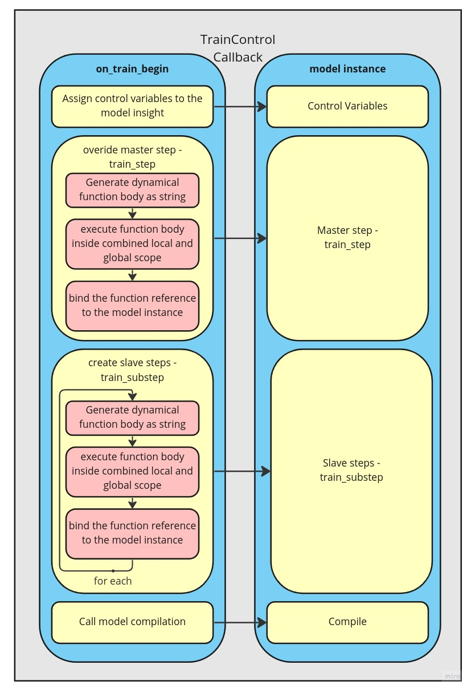
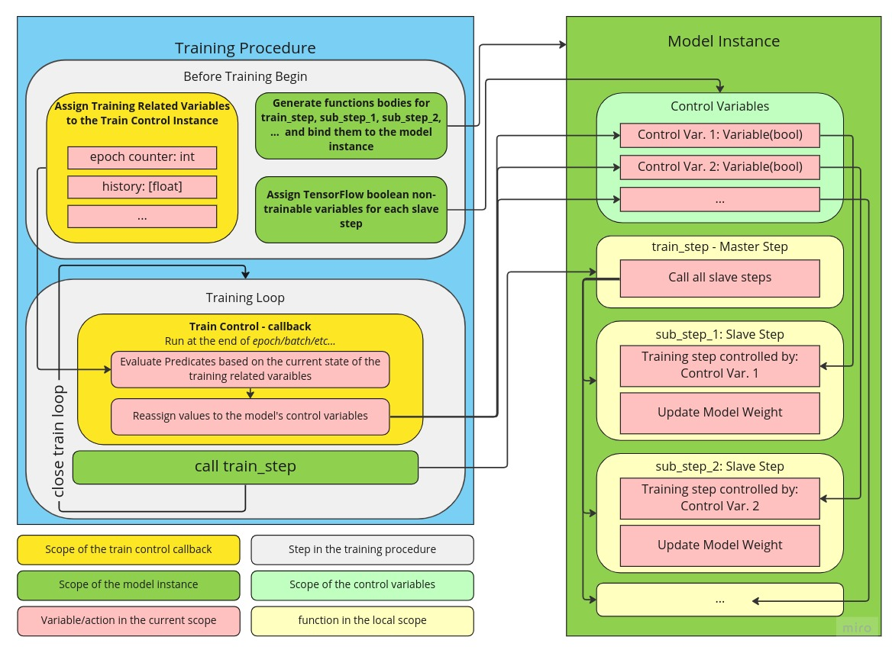

# Loop Control Callback Dictionary of Configuration

## Aim of this work
The aim of this work is to engineer and test a new approach towards the Tensor-
Flow training API. Embedding custom training procedures in the present Tensor-
Flow distribution relies on training loop reimplementations. It is not portable, and
we miss a lot of great TensorFlow default functionalities. Therefore, we success-
fully built and tested the wrapper to customise the training procedure based on the
easy-to-read and modified Python configuration dictionaries. It keeps the default
TensorFlow training API by adjusting the compilation of the data-flow graph. Util-
ising our novel approach, we successfully trained deep models of stacked improved
Neural Arithmetic Logic Units (iNALU) layers. We discuss the architectural and
technical decisions to deliver versatile and fresh functionality in the TensorFlow
environment.

For more details read: [this](NovelTFTrainApproachOnINALU.pdf)

## Proof of Concept

See proof of concept noteboook: [this](proof_of_concept.ipynb)


## High-level Overview


We must remember that both Train Control Callback and the model instance are consumed inside the body of the **model.fit** function. Therefore, we can consider callback as a **model.fit** argument. Before our model starts learning, we configure it in 4 steps according to the values passed as the constructor arguments of the callback. First, we assign control variables to the model instance from the callback position. Then we generate, execute, and bind the master and slave steps. Eventually, we recompile the model using the same compiler and compiler's setting as at the time of model compilation before calling **model.fit** function.




Before Training Begin refers to the sequence of steps depicted
in the figure above. Three things happen sequentially when the training loop
starts iterating over batches (Training Loop rectangle). First, training control
predicates are evaluated based on the training state (e.g. epoch, batches, or
loss). Then we assign these values to the model control variables. The model’s
train step step is called at the end of the single interaction step. We can
spot that the state of the model’s control variables controls train step that
aggregate calls to all salve steps. This way, we superimpose training logic to
the model instance, unaware of the training progress. We can consider it a
small coupling between the model and the models’ training or a dynamical logic
projection onto the model.


## Training Control - Configuration Dictionaries
For details visit Chapter 4 of the [report](NovelTFTrainApproachOnINALU.pdf).
### Training Control - Tracking Values

```python
"""
You can build your training logic based on the tracking values inside the Training Control Callback. History holds all the log passed to the callback. In the case of iNALU training we have access to the lossses of the training substeps as well.
"""
self.history: List[Dict[string: any]] # - adjustable history keeping logs from each training epoch
self.epoch: int # number of epochs since the start of training
self.batches: int # number of batches since the start of training
self.batches_in_epochs: int # number of batches since the start of epoch
self._global_history: [Dict[string: any]] # onlywrite history keeping logs from the whole training
```
### Training Control - Action Configuration

```python
# Declare functions like if they were members of the Training Control. See run_full_simulation.py
def condition_callable(self) -> bool:
    """Build your training logic based on the trackign values"""
    return self.batches % 10 < 8

"action_name": {
    "cond": condition_callable, # python callable that returns boolean
    # and has no argumnets in the function signature
    True: { 
        # set of configuration that will adjust the training step 
        # run for the positive evaluation of the concondition_callable
        <action_true_configuration> # configuration dictionary with values described below 
        },
    False: {
        # set of configuration that will adjust the training step 
        # run for the negative evaluation of the concondition_callable
        <action_false_configuration> # configuration dictionary with values described below 
        },
},
```

### Loss

```python
"loss": tf.keras.losses.MeanSquaredError() # - TenosrFlow function loss,
"loss": None/False # - use zero loss function
<missing_loss_key> # - use compiled loss
```
### Regularize

```python
"regularize": True # - include regularization loss
"regularize": False # - does not include regularization loss
<missing_regularize_key> # - does not include regularization loss
```

### Clipping

```python
"clipping": (-1.0, 1.0) # - clip gradient between -1.0 and 1
<missing_clipping_key> # - does not modify gradient
```

### Variables

```python
def get_gates_variables(self) -> List[tf.Variable]:
    """Callable returning list of trainable variables. In this case return all gate variables used in the iNALU model."""
    return [layer.g for layer in self.layers if isinstance(layer, NALU)]

"variables": get_gates_variables # - include only this variables from training
"excluded_variables": get_gates_variables # - exclude only this variables from training
<missing_variables_key> # - include all trainable variables
<missing_excluded_variables_key> # - include all trainable variables
```


## Async. Configuration Dictionary

### Async. Control - Action Configuration
```python

"async_action_name": {
    "cond": condition_callable, # python callable that returns boolean
    # and has no argumnets in the function signature
    "model" action_callable_model, # call action_callable at the positive evaluation of the condition_callable while bining the callable to the model instance
    "callaback" action_callable_callback, # call action_callable at the positive evaluation of the condition_callable while bining the callable to the training control callback instance
    <missing_either_model_or_callback_key> # - we can ommit either callback or model key
},
```

## INALU Training Example

### Training Configuration Dictionary

```python

def gate_open(self) -> bool:
    return self.batches % 10 < 8

def delay_reg(self) -> bool:
    return self.epochs > 10 and self.history and self.history[-1]["loss"] < 1.0

def get_gates_variables(self) -> List[tf.Variable]:
    return [layer.g for layer in self.layers if isinstance(layer, NALU)]

config = {
    "gate": {
        "cond": gate_open,
        True: {
            "clipping": (-0.1, 0.1), 
            "excluded_variables": get_gates_variables},
        False: {
            "clipping": (-0.1, 0.1),
            "variables": get_gates_variables},
    },
    "delay": {
        "cond": delay_reg, 
        True: {"loss": False, "regularize": True}
        },
}
```

### Async Configuration Dictionary

```python

def reinit_cond(self):
    reinit_loss = [x["loss"] for x in self.history]
    return (len(reinit_loss) > 10000) and (
        tf.math.reduce_mean(reinit_loss[-3000:]) > 0.2
    )

def reinitialise_fn(self):
    for layer in self.layers:
        if isinstance(layer, NALU):
            layer.reinitialize()

def reinitialise_metrics(self):
    self.history = []
    self.epochs = 0
    self.batches = 0

def early_stopping(self):
    return tf.experimental.numpy.log10(
        tf.math.reduce_mean([x["loss"] for x in self.history][-3000:])
        ) < -10
            
def stop_training(self):
    self.model.stop_training = True

async_config = {
    "reinitialize": {
        "cond": reinit_cond,
        "model": reinitialise_fn,
        "callback": reinitialise_metrics,
    },
    "eraly_stopping": {
        "cond": early_stopping,
        "callback": stop_training,
    }
}
```

### Running iNALU Training

```python
from loop_control import LoopControlerCallback

# configuration dictionaries above
# loading training data
# model initial compilation
...

loopControl = LoopControlerCallback(config, async_config, verbose=1)
history = model.fit(
    data_dp, 
    epochs=120, 
    verbose=1, 
    callbacks=[loopControl]
    )
```

    
